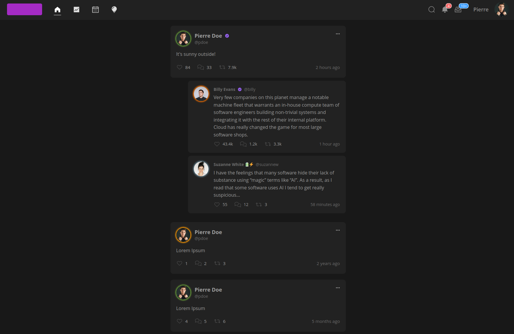

# frontend

Source for the first POC frontend of OpenDolphin.



## Requirements

- Node.JS (LTS)
- YARN
- (Docker)

## Getting started

### Node.JS from the OS

```bash
yarn install
yarn run vite
# Visit http://127.0.0.1:5173 
```

### With Node.JS in Docker

```bash
host $ make dev-run
host $ make dev-exec
container $ yarn install
container $ yarn run vite --host
# Visit http://127.0.0.1:3000 on your host 
```